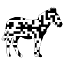



# ZXing.Delphi
ZXing Barcode Scanning Library for Delphi XE7 to 10.2 Tokyo.

This repository is only a redirection link to provide Delphinus-Support - please report any issues or pull requests on [the main repository](https://github.com/Spelt/ZXing.Delphi)
------------------------------------------------------------------------------------------------------------------------------------------------------------

ZXing.Delphi is a native Object Pascal library that is based on the well known open source Barcode Library: ZXing (Zebra Crossing). This port is based on .Net Redth port of ZXing and the Java one. This is I think the first native FireMonkey barcode lib. It is aimed at all of the FireMonkey mobile platforms and, starting from v3.1, it fully supports also Windows VCL applications (no dependencies on FMX.Graphics unit).

With this library you can scan with native speed without the use of linking in external libraries and avoid compatibility issues and dependencies. It is fast.

Its compatible with in Delphi XE7 - 10 Tokyo and tested with IOS 8.x, 9.x, 10x Android, Windows 32/64 and OSX.
The goal of ZXing.Delphi is to make scanning barcodes effortless, painless, fast and build within your FireMonkey or native Windows (VCL or Firemonkey) applications.

### Miscellaneous
You can install [Delphinus package manager](https://github.com/Memnarch/Delphinus/wiki/Installing-Delphinus) and install ZXing.Delphi as a package there.
